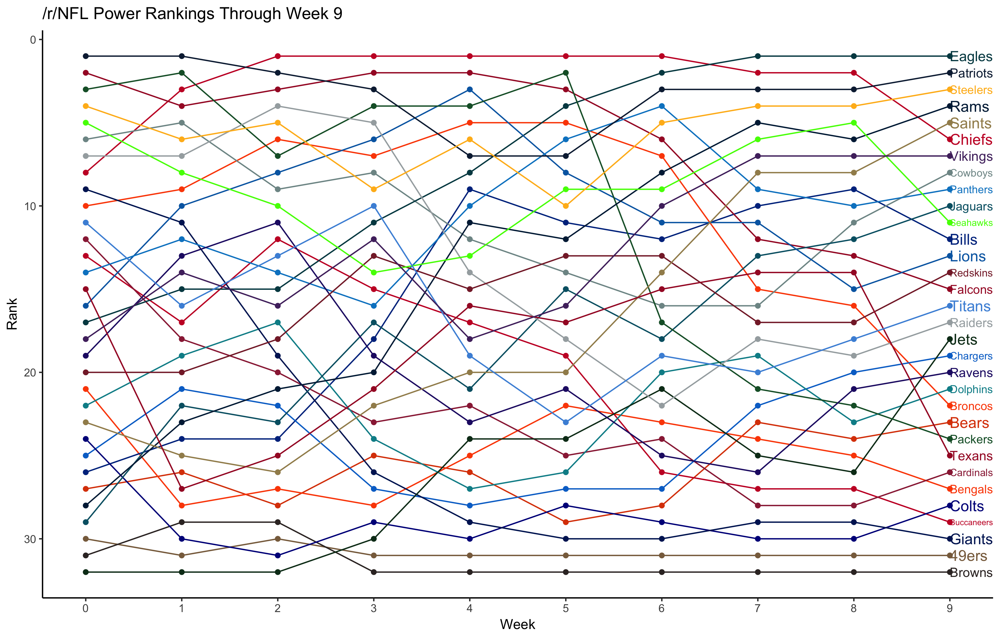
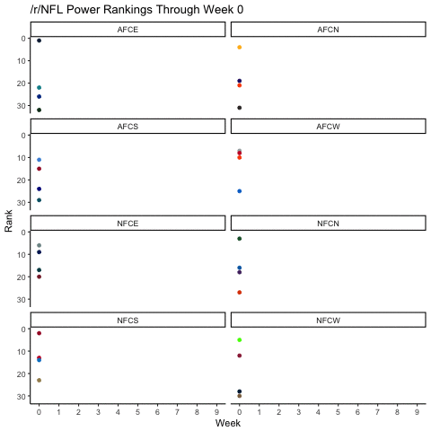
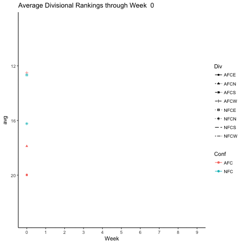

# /r/NFL Power Ranking Visualization
Tyler Worzel  
11/9/2017  


# Introduction

Reddit is a great place for sports fans. News, gamethreads, analysis, highlights, and much more are posted and broken down by fellow fans. It is a huge community-driven collection that satisfies any sporting fan needs, and serves as an excellent supplement to ESPN, Bleacher Report, and the like. The [/r/NFL](www.reddit.com/r/NFL) subreddit is a perfect example of a great community. 

Like nearly every popular sports website out there, Tuesday morning means NFL power rankings, where analysts rank teams 1-32 based on how good they are. Whether it be ESPN's 'power panel' of rankers, 538's ELO ranking methodology, or Bleacher Report's one man show, power rankings are a great place to gauge how your team is doing. 

But what about the community? Well, /r/NFL has their method too. Each week, 32 representatives, one from each team's fanbase, create their own power rankings which are aggregated and posted to the community, with each representative writing a little blurb on their feelings of the team week by week. These rankings are then discussed within the community, where fans are free to cheer, complain, and sometimes all out argue over their team's rankings. Even the rankers are available to defend their sometimes outlandish decisions, like why /u/whirledworld ranked the Jaguars #3 in Week 5. 

[Here](https://www.reddit.com/r/nfl/comments/75ismt/official_rnfl_week_5_power_rankings/) are the Week 5, 2017 /r/NFL power rankings. 

Now, while this is a great way to view the /r/NFL power rankings, there's so much going on behind the scenes that we aren't seeing from this write-up alone. 


# Prep Work 

## Packages Used


```r
library(tidyverse) # Reading, cleaning, visualizing
library(rvest) # Reading
library(reshape) # Melting
library(plyr) # Summary stats
library(directlabels) # Viz help
library(scales) # Viz help
library(gganimate) # Animation
library(animation) # Animation
library(magick) # Animation
library(knitr)
```

## Getting the Data

Luckily for us, /u/NFLPowerRankers keeps track of how each ranker votes for each week in a google doc, [located here](https://docs.google.com/spreadsheets/d/e/2PACX-1vSdFW_RZwS8TAMbbVr7rRkEv5kaRduhU3CiJ1MEkIHUe-X14NykrW9IM5Rw3VE98lg_ZjYhAF-01zKO/pubhtml), which is easily read with a package like `rvest` (from `tidyverse`). With the html page read, we have to extract the table from the document. Luckily enough in this case, we can just grab the sheets and parse them into tables. The result is a list of 18 data.frames, one for weeks 0-17 of the NFL season. 


```r
ranks_2017_url <-
  read_html(
  "https://docs.google.com/spreadsheets/d/e/2PACX-1vSdFW_RZwS8TAMbbVr7rRkEv5kaRduhU3CiJ1MEkIHUe-X14NykrW9IM5Rw3VE98lg_ZjYhAF-01zKO/pubhtml"
  )
  
  ranks_2017_list <- ranks_2017_url %>%
  html_nodes("table") %>%
  html_table() 
  
  ranks_2017_list <- ranks_2017_list[5:22] #Keep only the tables that we need
```

It's probably worth double checking the number of tables and the structure of one


```r
length(ranks_2017_list) # Number of tables
glimpse(ranks_2017_list[[1]]) # Structure
```

```
## [1] 18
## Observations: 34
## Variables: 44
## $ `` <int> 1, NA, 2, 3, 4, 5, 6, 7, 8, 9, 10, 11, 12, 13, 14, 15, 16, ...
## $ `` <int> NA, NA, 1, 2, 3, 4, 5, 6, 7, 8, 9, 10, 11, 12, 13, 14, 15, ...
## $ `` <lgl> NA, NA, NA, NA, NA, NA, NA, NA, NA, NA, NA, NA, NA, NA, NA,...
## $ `` <chr> "sknich49ers", "", "Patriots", "Falcons", "Steelers", "Pack...
## $ `` <chr> "pygreg Bears", "", "Patriots", "Seahawks", "Steelers", "Pa...
## $ `` <chr> "ArbysguyBengals", "", "Patriots", "Packers", "Seahawks", "...
## $ `` <chr> "PenguinProphetBills", "", "Patriots", "Falcons", "Seahawks...
## $ `` <chr> "BlindManBaldwinBroncos", "", "Patriots", "Falcons", "Seaha...
## $ `` <chr> "ThaddeusJPBrowns", "", "Patriots", "Falcons", "Packers", "...
## $ `` <chr> "LandsdownestreetBuccaneers", "", "Patriots", "Seahawks", "...
## $ `` <chr> "TangerineDieselCardinals", "", "Patriots", "Packers", "Ste...
## $ `` <int> NA, NA, 1, 2, 3, 4, 5, 6, 7, 8, 9, 10, 11, 12, 13, 14, 15, ...
## $ `` <chr> "milkchococurryChargers", "", "Patriots", "Falcons", "Seaha...
## $ `` <chr> "IIHURRlCANEIIChiefs", "", "Patriots", "Falcons", "Steelers...
## $ `` <chr> "morespikesColts", "", "Patriots", "Cowboys", "Seahawks", "...
## $ `` <chr> "staub81Cowboys", "", "Patriots", "Falcons", "Packers", "St...
## $ `` <chr> "yoda133113Dolphins", "", "Patriots", "Falcons", "Steelers"...
## $ `` <chr> "famouslastwordsEagles", "", "Patriots", "Falcons", "Seahaw...
## $ `` <chr> "wannaknowmynameFalcons", "", "Patriots", "Falcons", "Packe...
## $ `` <chr> "SexterminatorGiants", "", "Patriots", "Packers", "Steelers...
## $ `` <int> NA, NA, 1, 2, 3, 4, 5, 6, 7, 8, 9, 10, 11, 12, 13, 14, 15, ...
## $ `` <chr> "preludeoflightJaguars", "", "Patriots", "Packers", "Falcon...
## $ `` <chr> "nickmangoldsbeardJets", "", "Patriots", "Seahawks", "Cowbo...
## $ `` <chr> "sosuhmeLions", "", "Patriots", "Falcons", "Giants", "Steel...
## $ `` <chr> "analogWeaponPackers", "", "Patriots", "Steelers", "Packers...
## $ `` <chr> "allsecretsknownPanthers", "", "Patriots", "Packers", "Seah...
## $ `` <chr> "SPACE_LAWYERPatriots", "", "Patriots", "Falcons", "Packers...
## $ `` <chr> "newBreedRaiders", "", "Patriots", "Falcons", "Packers", "S...
## $ `` <chr> "One_Half_HamsterRams", "", "Patriots", "Falcons", "Steeler...
## $ `` <int> NA, NA, 1, 2, 3, 4, 5, 6, 7, 8, 9, 10, 11, 12, 13, 14, 15, ...
## $ `` <chr> "I_have_no_throwawayRavens", "", "Patriots", "Falcons", "Se...
## $ `` <chr> "ThatChrisDodgeRedskins", "", "Patriots", "Falcons", "Cowbo...
## $ `` <chr> "Naly_DSaints", "", "Patriots", "Seahawks", "Steelers", "Pa...
## $ `` <chr> "iltat_workSeahawks", "", "Seahawks", "Patriots", "Falcons"...
## $ `` <chr> "smacksawSteelers", "", "Patriots", "Packers", "Falcons", "...
## $ `` <chr> "SkarmotasticTexans", "", "Patriots", "Falcons", "Steelers"...
## $ `` <chr> "philo13181Titans", "", "Patriots", "Falcons", "Packers", "...
## $ `` <chr> "whirledworldVikings", "", "Steelers", "Patriots", "Seahawk...
## $ `` <int> NA, NA, 1, 2, 3, 4, 5, 6, 7, 8, 9, 10, 11, 12, 13, 14, 15, ...
## $ `` <lgl> NA, NA, NA, NA, NA, NA, NA, NA, NA, NA, NA, NA, NA, NA, NA,...
## $ `` <chr> "Teams", "", "49ers", "Bears", "Bengals", "Bills", "Broncos...
## $ `` <chr> "Median", "", "30", "27", "20", "26", "10.5", "30", "14", "...
## $ `` <chr> "Mean", "", "29.63", "26.84", "19.41", "26.16", "11.81", "3...
## $ `` <chr> "StandardDeviation", "", "1.431", "1.679", "3.613", "2.152"...
```

## Cleaning the Data

The tables are a little raw, so let's clean them up a bit. 


```r
ranks_2017_list_clean <- lapply(ranks_2017_list, function(x) {
    x <- x[!is.na(x[,1]),]
    colnames(x) <- x[1, ]    # First row as names
    x <- x[,-c(1,3)]
    x <- x[, grep("^(NA)", names(x), value = TRUE, invert = TRUE)] # Drop NA columns
    x <- x[, !(colnames(x) %in% c("Teams", "Median", "Mean", "StandardDeviation"))]
    x <- x[-1,]
    x <- x[,apply(x,2,is.unsorted)] # Drop columns that are sorted
    x <- cbind("Rank"=1:32,x)
})

# Week numbers
names(ranks_2017_list_clean) <- 0:17

ranks_2017_list_clean[[1]]
```

| Rank|sknich49ers |pygreg Bears |ArbysguyBengals |PenguinProphetBills |
|----:|:-----------|:------------|:---------------|:-------------------|
|    1|Patriots    |Patriots     |Patriots        |Patriots            |
|    2|Falcons     |Seahawks     |Packers         |Falcons             |
|    3|Steelers    |Steelers     |Seahawks        |Seahawks            |
|    4|Packers     |Packers      |Cowboys         |Steelers            |
|    5|Cowboys     |Falcons      |Steelers        |Packers             |
|    6|Chiefs      |Raiders      |Chiefs          |Giants              |
|    7|Seahawks    |Chiefs       |Falcons         |Cowboys             |
|    8|Raiders     |Cowboys      |Raiders         |Raiders             |
|    9|Broncos     |Broncos      |Broncos         |Chiefs              |
|   10|Panthers    |Cardinals    |Giants          |Broncos             |
|   11|Giants      |Giants       |Cardinals       |Buccaneers          |
|   12|Buccaneers  |Titans       |Panthers        |Titans              |
|   13|Titans      |Panthers     |Titans          |Lions               |
|   14|Cardinals   |Eagles       |Bengals         |Cardinals           |
|   15|Lions       |Texans       |Vikings         |Texans              |
|   16|Texans      |Vikings      |Lions           |Ravens              |
|   17|Bengals     |Buccaneers   |Texans          |Bengals             |
|   18|Vikings     |Redskins     |Redskins        |Redskins            |
|   19|Redskins    |Ravens       |Eagles          |Eagles              |
|   20|Eagles      |Colts        |Dolphins        |Panthers            |
|   21|Ravens      |Lions        |Ravens          |Dolphins            |
|   22|Dolphins    |Saints       |Buccaneers      |Saints              |
|   23|Colts       |Bengals      |Saints          |Vikings             |
|   24|Saints      |Chargers     |Colts           |Chargers            |
|   25|Chargers    |Dolphins     |Chargers        |Bills               |
|   26|Bills       |Bears        |Bills           |Rams                |
|   27|49ers       |Bills        |Rams            |Bears               |
|   28|Bears       |Rams         |Bears           |Jets                |
|   29|Jaguars     |Jaguars      |Browns          |Colts               |
|   30|Browns      |Browns       |Jaguars         |Jaguars             |
|   31|Rams        |49ers        |49ers           |49ers               |
|   32|Jets        |Jets         |Jets            |Browns              |


Worth noting above that the `is.unsorted` call will drop any columns that are sorted. Occasionally, if a /r/NFL ranker did not report, their column of rankings would be in alphabetical order instead of having '--' values. This will take care of that issue. 


Now we have our 18 weeks worth of power rankings. It's easy to look at in this format, but unfortunately not great for analysis at all. 

## Prep for analysis 

The `melt` function from the `reshape` package will turn the tables into 'tidy' data: each observation has a row, each variable has a column. The following code will melt the data, as well as drop NA values denoted by '--'.


```r
df_2017 <- melt(ranks_2017_list_clean, id = 'Rank', variable_name = 'Ranker')

  names(df_2017) <- c('Rank', 'Ranker', 'Team', 'Week')
  
  df_2017$Week   <- as.numeric(df_2017$Week)
  
  # Drop NA values
  df_2017[df_2017 == '--'] <- NA
  df_2017 <- df_2017 %>% drop_na()
  
  head(df_2017)
```

| Rank|Ranker      |Team     | Week|
|----:|:-----------|:--------|----:|
|    1|sknich49ers |Patriots |    0|
|    2|sknich49ers |Falcons  |    0|
|    3|sknich49ers |Steelers |    0|
|    4|sknich49ers |Packers  |    0|
|    5|sknich49ers |Cowboys  |    0|
|    6|sknich49ers |Chiefs   |    0|


## Adding the color codes

Each team generally has a primary and secondary color (some teams may have more than two), and using them will look a lot better than using default colors for visualizing. I manually keyed the primary and secondary hex codes using [Team Color Codes](https://teamcolorcodes.com/nfl-team-color-codes/) as a basis. I also added useful things like Abbreviation, Division, and Location just in case I needed them.


```r
nfl_color_codes <- read_csv("nfl_color_codes.csv")
df_2017_col <- merge(nfl_color_codes[,c('Team','NFL_color','NFL_color2','Div')],df_2017)

df_2017_col$Conf <- substring(df_2017_col$Div,1,3)

head(df_2017_col[with(df_2017_col,order(Week,Ranker,Rank)),])
```

|Team     |NFL_color |NFL_color2 |Div  | Rank|Ranker      | Week|Conf |
|:--------|:---------|:----------|:----|----:|:-----------|----:|:----|
|Patriots |#0C2340   |#C8102E    |AFCE |    1|sknich49ers |    0|AFC  |
|Falcons  |#A6192E   |#101820    |NFCS |    2|sknich49ers |    0|NFC  |
|Steelers |#FFB81C   |#101820    |AFCN |    3|sknich49ers |    0|AFC  |
|Packers  |#175E33   |#FFB81C    |NFCN |    4|sknich49ers |    0|NFC  |
|Cowboys  |#7F9695   |#041E42    |NFCE |    5|sknich49ers |    0|NFC  |
|Chiefs   |#C8102E   |#FFB81C    |AFCW |    6|sknich49ers |    0|AFC  |

Excellent, now we can begin analysis! 

# Summary stats

Before we can do any summary work, we should filter out the weeks that there are no power rankings yet. We can enter the week number below to filter out the unneeded data.


```r
weekno <- 9
df.weekno <- df_2017_col[df_2017_col$Week <= weekno,]
```

## By team, by week

Now we can grab the median, average, and standard deviation of ranks for each team by weeks. Additionally, we can grab the ranks of each team, numbered 1 through 32. 

The ranking methodology here is to order by median first, then use the average as a tiebreaker. 


```r
sumstats_byweek_byteam <- ddply(df.weekno, .(Week,Team,Div,NFL_color,NFL_color2,Conf), summarize, 
                                med = median(Rank),
                                avg = round(mean(Rank),2),
                                sd=round(sd(Rank),2))

# Order
sumstats_byweek_byteam <- sumstats_byweek_byteam[
  with(sumstats_byweek_byteam,order(Week,med,avg)),
]

# Rank
sumstats_byweek_byteam$Rank <- 1:32

head(sumstats_byweek_byteam)
```


| Week|Team     |Div  |NFL_color |NFL_color2 |Conf | med|  avg|   sd| Rank|
|----:|:--------|:----|:---------|:----------|:----|---:|----:|----:|----:|
|    0|Patriots |AFCE |#0C2340   |#C8102E    |AFC  |   1| 1.06| 0.25|    1|
|    0|Falcons  |NFCS |#A6192E   |#101820    |NFC  |   2| 3.22| 1.81|    2|
|    0|Packers  |NFCN |#175E33   |#FFB81C    |NFC  |   4| 4.09| 1.80|    3|
|    0|Steelers |AFCN |#FFB81C   |#101820    |AFC  |   4| 4.50| 1.83|    4|
|    0|Seahawks |NFCW |#4DFF00   |#001433    |NFC  |   5| 4.50| 1.92|    5|
|    0|Cowboys  |NFCE |#7F9695   |#041E42    |NFC  |   5| 5.50| 1.76|    6|

## By division, by week

We can also grab the same stats by division by week
 

```r
sumstats_byweek_bydiv <- ddply(df.weekno, .(Week,Div,Conf), summarize, 
                                med = median(Rank),
                                avg = round(mean(Rank),2),
                                sd=round(sd(Rank),2))


head(sumstats_byweek_bydiv)
```


| Week|Div  |Conf |  med|   avg|    sd|
|----:|:----|:----|----:|-----:|-----:|
|    0|AFCE |AFC  | 25.0| 19.97| 11.74|
|    0|AFCN |AFC  | 19.0| 17.88|  9.54|
|    0|AFCS |AFC  | 19.5| 19.99|  7.28|
|    0|AFCW |AFC  |  9.0| 12.51|  7.11|
|    0|NFCE |NFC  | 13.0| 12.67|  6.16|
|    0|NFCN |NFC  | 17.0| 16.23|  8.68|

# Visualizations

Now that we have our summary stats, we can look at some interesting things like rankings over time, both by team and by division. 

## Line graphs

Let's first take a look at some line plots of true rankings over time, to get an idea of how teams are faring as the season progresses. 


```r
l1 <- ggplot(sumstats_byweek_byteam,aes(x=Week,y=Rank,group=Team,color=NFL_color))+
  theme_classic()+
  geom_line()+
  geom_point(aes(color=NFL_color))+
  scale_y_reverse()+
  scale_color_identity()+
  scale_x_continuous(breaks=pretty_breaks(n=weekno+1)) + 
  geom_dl(aes(label=Team),method='last.qp',cex=0.8)+
  ggtitle(paste0('/r/NFL Power Rankings Through Week ', weekno))
  

ggsave(paste0('LineGraphWeek',weekno,'.png'),l1,height=7,width=11)
```


 Things look a little crowded here, so let's facet by division and then do some fun animation 
 

```r
a1 <- ggplot(sumstats_byweek_byteam,aes(x=Week,y=Rank,group=Team,color=NFL_color,frame=Week,cumulative=TRUE))+
  theme_classic()+
  geom_line()+
  geom_point(aes(color=NFL_color))+
  scale_y_reverse()+
  scale_color_identity()+
  scale_x_continuous(breaks=pretty_breaks(n=weekno+1)) + 
  facet_wrap(~Div,ncol=2)+
  ggtitle('/r/NFL Power Rankings Through Week')

ani1 <- gganimate(a1,'ani1.gif')
```



Looks great! 

Another thing we could look at is the average divisional strength over time based on our lovely rankers. 


```r
p1 <- ggplot(sumstats_byweek_bydiv,aes(x=Week,y=avg,group=Div,color=Conf,frame=Week,shape=Div,cumulative=TRUE))+
  theme_classic()+
  geom_line(aes(linetype=Div))+geom_point()+
  scale_y_reverse()+
  scale_x_continuous(breaks=pretty_breaks(n=weekno+1)) + 
  ggtitle(paste0('Average Divisional Rankings through Week '))
ani2 <- gganimate(p1,'DivRank.gif')
```


## Box Plots

Now we can look at the box plots of the data, to see exactly the distribution of rankings. We'll just grab the current week's data for the moment. 


```r
df.week <- df.weekno[df.weekno$Week == weekno,]
sumstats.week <- sumstats_byweek_byteam[sumstats_byweek_byteam$Week == weekno,]
week.rank <- sumstats.week$Team

b1 <- ggplot(df.week,aes(x=Team,y=Rank,fill=NFL_color))+
  theme_classic()+
  geom_jitter(aes(color=NFL_color))+ # Plot the points
  scale_color_identity()+ # Color the points
  stat_boxplot(geom='errorbar')+
  geom_boxplot(outlier.shape=NA)+ # Hide the outliers
  scale_y_reverse()+ 
  scale_fill_identity()+ # Color the boxplot
  scale_x_discrete(limits=week.rank)+ # Order 
  theme(axis.text.x = element_text(angle = 90,vjust = 0.5 ))+
  ggtitle(paste0('/r/NFL Week ', as.character(weekno), ' Rankings'))
ggsave('Plainbox.png',b1)
```

It's pretty tough to see the medians for some teams, so we'll color them using the secondary color. In order to do this, we must add the NFL_color2 aesthetic to the boxplot. Unfortunately, this will make the outline and the whiskers of the boxplots the secondary color as well, which isn't what I'd like to go for here. 

So, to get the desired output, we need to add the NFL_color2 aesthetic to our boxplot, grab the build using `ggplot_build` then use that data to draw our medians in the secondary colors. 


```r
r <- ggplot(df.week,aes(x=Team,y=Rank,fill=NFL_color,color=NFL_color2))+
  geom_boxplot()+
  scale_x_discrete(limits=week.rank)+
  scale_y_reverse()+
  scale_fill_identity()+
  scale_color_identity()

dat <- ggplot_build(r)$data[[1]]
```

We will use `xmin`, `xmax`, and `middle` variables to draw the median. The `colour` variable will help us color the lines with the secondary color. 


```r
b2 <- b1 + geom_segment(data=dat, aes(x=xmin, xend=xmax, y=-1*middle, yend=-1*middle,color=colour),
                 inherit.aes = FALSE,
                 size = 1) +
    theme_classic()+
  theme(axis.text.x = element_text(angle = 90,vjust = 0.5 ))+
  scale_color_identity()

ggsave('Prettybox.png',b2)
```


Beautiful. Now we have team-themed boxplots. We could stop here and admire our masterpiece, but I'm still not satisfied. It's great that we can see the order of the teams, but including the summary stats would add the cherry on top of this plot. 

